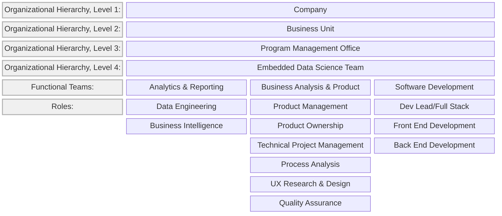
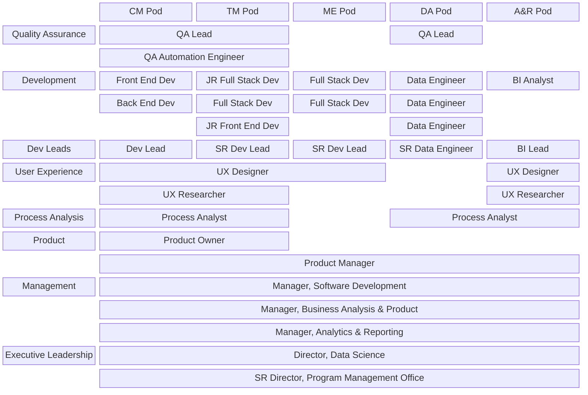

# Analytics, Reporting, and Software Team Operating Model
## Table of Contents
* Team Structure
  * Functional
  * Operational

## Team Structure
### Functional

### Operational
* This team was part of a larger matrixed organization and followed the same approach by matrixing resources from the above model (vertical reporting organizations, "Functional Teams") across product focused delivery teams (aka "Pods").

