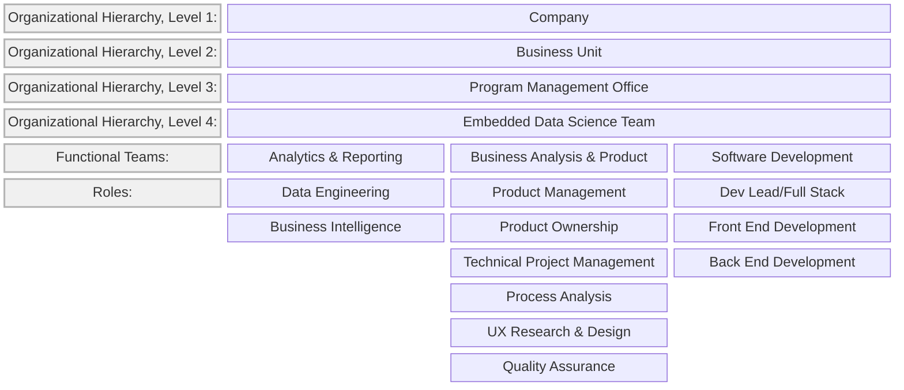
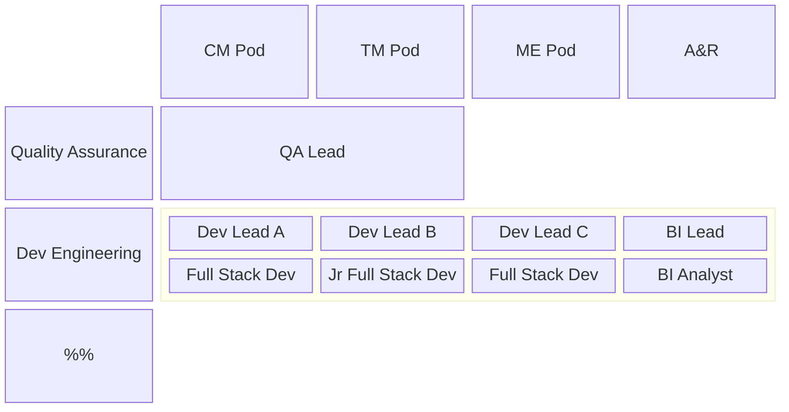

# Analytics, Reporting, and Software Team Operating Model
## Table of Contents

## Team Structure
### Functional

```mermaid

block-beta

columns 4

%% business hierarchy
id01["Organizational Hierarchy, Level 1:"]
id02["Company"]:3
id03["Organizational Hierarchy, Level 2:"]
id04["Business Unit"]:3
id05["Organizational Hierarchy, Level 3:"]
id06["Program Management Office"]:3
id07["Organizational Hierarchy, Level 4:"]
id08["Embedded Data Science Team"]:3

%% verticals
id09["Functional Teams:"]
id10["Analytics & Reporting"]
id11["Business Analysis & Product"]
id12["Software Development"]

%% row 1
id13["Roles:"]
id14["Data Engineering"]
id15["Product Management"]
id16["Dev Lead/Full Stack"]

%% row 2
space
id17["Business Intelligence"]
id18["Product Ownership"]
id19["Front End Development"]

%% row 3
space
space
id20["Technical Project Management"]
id21["Back End Development"]

%% row 4
space
space
id22["Process Analysis"]
space

%% row 5
space
space
id23["UX Research & Design"]
space

%% row 6
space
space
id24["Quality Assurance"]
space

%% row label styling
style id01 fill:#f0f0f0, stroke:#b4b4b4, stroke-width:2px
style id03 fill:#f0f0f0, stroke:#b4b4b4, stroke-width:2px
style id05 fill:#f0f0f0, stroke:#b4b4b4, stroke-width:2px
style id07 fill:#f0f0f0, stroke:#b4b4b4, stroke-width:2px
style id09 fill:#f0f0f0, stroke:#b4b4b4, stroke-width:2px
style id13 fill:#f0f0f0, stroke:#b4b4b4, stroke-width:2px


```

### Operational

```mermaid

block-beta

columns 5

%% pods
space
id01["CM Pod"]
id02["TM Pod"]
id03["ME Pod"]
id04["A&R"]
%% styling
%% style id01 fill:#f0f0f0, stroke:#b4b4b4
%% style id02 fill:#f0f0f0, stroke:#b4b4b4
%% style id03 fill:#f0f0f0, stroke:#b4b4b4
%% style id04 fill:#f0f0f0, stroke:#b4b4b4

%% quality assurance
id05["Quality Assurance"]
id06["QA Lead"]:2
space
space
%% styling
%% style id05 fill:#ffcc80, stroke:#fcbb58
%% style id06 fill:#fcdeb1, stroke:#fcd79f

%% dev engineering
id07["Dev Engineering"]

block:group1:4
columns 4
id08["Dev Lead A"]
id09["Dev Lead B"]
id10["Dev Lead C"]
id11["BI Lead"]
id12["Full Stack Dev"]
id13["Jr Full Stack Dev"]
id14["Full Stack Dev"]
id15["BI Analyst"]
end

%% data engineering


%% 

```
