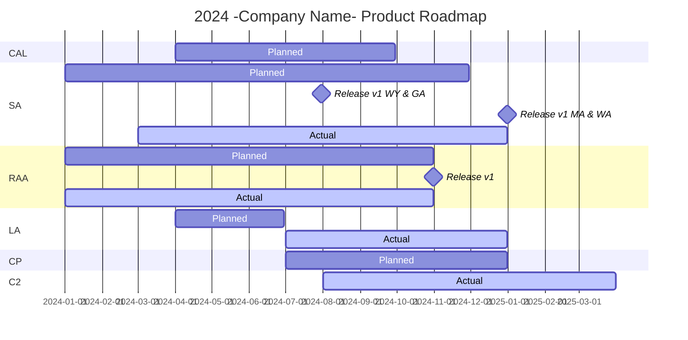

```mermaid

%% Note to self: probably just want to build in another tool and screencap

gantt
  dateFormat YYYY-MM-DD
%%  axisFormat %Y-%Q
%%  tickInterval 1quarter
  title 2024 -Company Name- Product Roadmap

  section CAL
  Planned  :a1, 2024-04-01, 2024-09-30
%%  Actual   :a2,

  section SA
  Planned  :b1, 2024-01-01, 2024-11-30
  Release v1 WY & GA  :milestone, 2024-07-31, 2m
  Release v1 MA & WA  :milestone, 2024-12-31, 4m
  Actual   :active, b2, 2024-03-01, 2024-12-31

  section RAA
  Planned  :c1, 2024-01-01, 2024-10-31
  Release v1  :milestone, 2024-10-31, 2m
  Actual   :active, c2, 2024-01-01, 2024-10-31

  section LA
  Planned  :d1, 2024-04-01, 2024-06-30
  Actual   :active, d2, 2024-07-01, 2024-12-31

  section CP
  Planned  :e1, 2024-07-01, 2024-12-31

  section C2
  Actual  :active, f1, 2024-08-01, 2025-03-31

```
