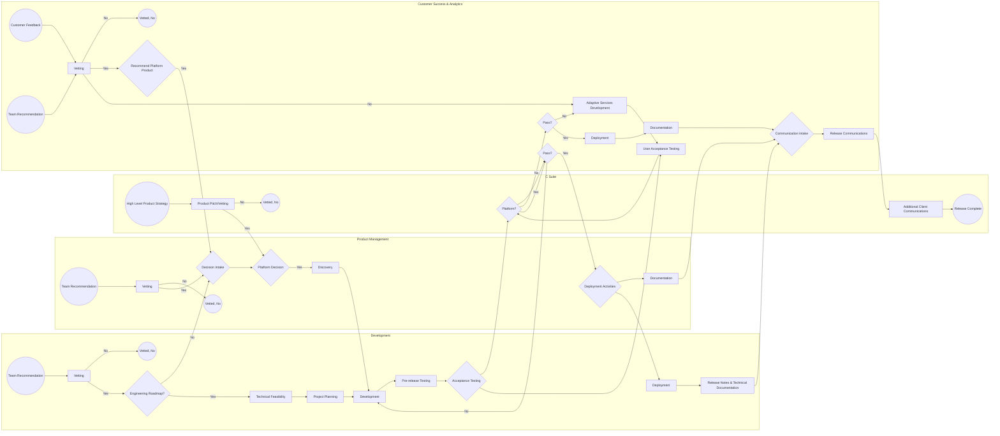

## Example Software Development Lifecycle (SDLC) Diagram

---

## Notes & Additional Context

* The production version of this document was built in Lucidchart utilizing BPMN2.0 - I have done my best to recreate this diagram using a Mermaid flowchart, however there will be some missing notation that isn't supported by Mermaid
* The following activities also have subprocesses under each of them, also captured in the Lucidchart version:
  * Adaptive Services Development
  * Discovery
* This diagram represents the SDLC I developed for implementation within an organization that did not have any prior SDLC standard in place
  * While this process is built on predefined standards for SDLC, it is tailored to the unique size, composition, and needs of the team that I implemented this for
