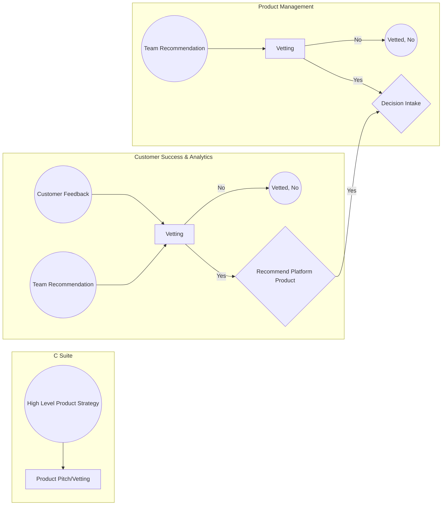

```mermaid

flowchart LR

subgraph C Suite
id01((High Level Product Strategy))
id04[Product Pitch/Vetting]
end

id01 --> id04

subgraph Customer Success & Analytics
id02((Customer Feedback))
id03((Team Recommendation))
id05[Vetting]
id06((Vetted, No))
id07{Recommend Platform Product}
end

id02 --> id05
id03 --> id05
id05 --"No"--> id06
id05 --"Yes"--> id07

subgraph Product Management
id08((Team Recommendation))
id09[Vetting]
id10((Vetted, No))
id11{Decision Intake}
end

id08 --> id09
id09 --"No"--> id10
id09 --"Yes"--> id11
id07 --"Yes"--> id11

```
